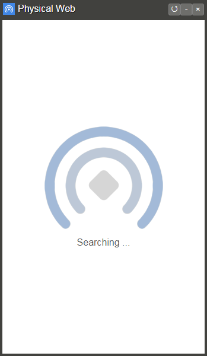

# Physical Web Chrome App

## Requirements

* Chrome >= 36

## Install

* Open [chrome://extensions/](chrome://extensions/) in Chrome Browser and enable developer mode
* Click on `Load unpacked extensions...` and select folder `<...>/physical-web/chrome`
* A new App `Physical Web` appears in Chrome Apps [chrome://apps/](chrome://apps/). 
* It is recommended to create a shortcut on the desktop, start menu or taskbar by right click on the Physical Web App icon and then select `create shortcuts...` menu item.
   
## Launch

* Click on the `Physical Web App` icon. 
* The Physical Web App starts scanning immediately after start.
* Reload the results by clicking on the refresh icon &#8634; in the top right corner of the App window or by selecting the `Refresh` item in the context menu.
* Click on any link from the result list if not empty to open it in Chrome Browser in a new tab.
* `NOTE`: The Physical Web Chrome App supports currently only [SSDP protocol](../documentation/ssdp_support.md) `TODO`: support [mDNS](mDNS_Support.md) and [URIBeacon](https://github.com/google/uribeacon).   

## Load and Launch from Command Line

Instead of launching the App as described above, there is another option to launch it directly from the command line as following:

### Window
```
<path to chrome.exe> --load-and-launch-app=<absolute path to physical-web/chrome folder>
```

`<path to chrome.exe>` is for example `"C:\Program Files (x86)\Google\Chrome\Application\chrome.exe"`

### Mac
```
open -n -a `<path to Chrome.app>` --args --load-and-launch-app=<absolute path to physical-web/chrome folder>
```

`<path to chrome.exe>` is for example `/Applications/Google\ Chrome.app`

### Linux
```
google-chrome --load-and-launch-app=<absolute path to physical-web/chrome folder>
```

`google-chrome` is the alias to chrome binary

## Screenshots 

* **Screenshot 1**: Physical Web Chrome App is searching for URLs
	
	

* **Screenshot 2**: Physical Web Chrome App displays found URLs
	
	

* **Screenshot 3**: Physical Web Chrome App cannot find any URL. Click on `Refresh` context menu item or refresh icon &#8634; in the top right corner of the App window to search again.
	
	

